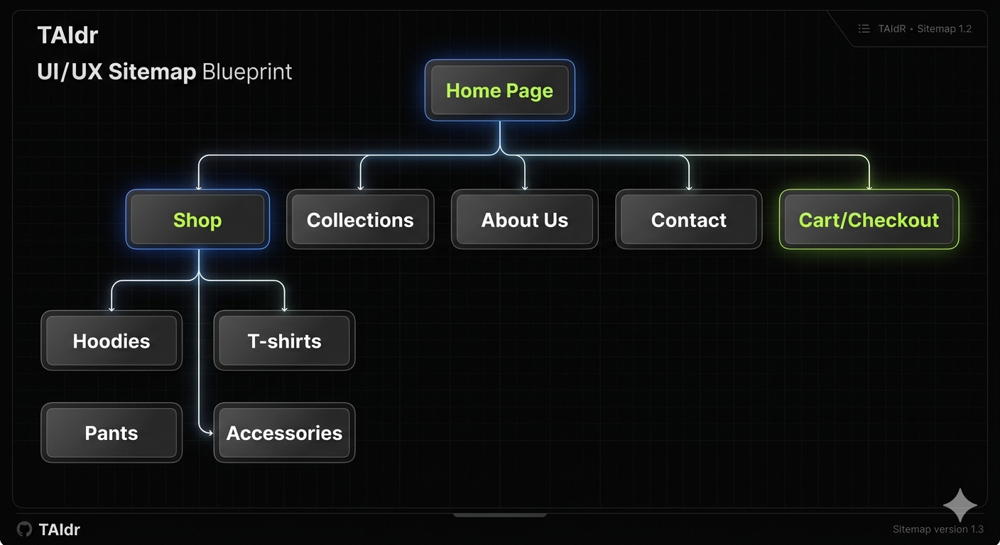

# TAIDR Online Clothing Store

# WEBSITE PROJECT PROPOSAL  
## TAIDR Streetwear Brand Website  

**Subject Name & Code:** Web Development (WD101)  
**Full Name:** [lethabo]
**Student Number:** [st10514103]  
**Group:** [Gr.1]  
**Date:** [20 april 2026]

## Project Overview
TAIDR is an online clothing store website developed as part of a project. The website showcases a modern streetwear brand with a focus on clean design, product display, and user-friendly navigation.

## Purpose of the Project
The purpose of this project is to demonstrate the development of a functional website using front-end technologies and version control systems.

##Technologies Used
- HTML (structure)
- CSS (styling)
- JavaScript (interactivity)
- Visual Studio Code
- Git & GitHub (version control)
## 🗺️ Site Map
The following diagram shows the structure of the website:

- Homepage with branding and navigation
- Product display section
- Simple and clean user interface
- Organized file structure

## Project Structure
- index.html
- style.css
- script.js
- images/

## Timeline & Milestones  

| Week | Task |
|------|------|
| Week 1 | Research, planning, and defining brand identity |
| Week 2 | Creating sitemap and wireframes |
| Week 3 | Developing website structure (HTML & CSS) |
| Week 4 | Styling, testing, and final improvements |

---

## 🔗 GitHub Repository
https://github.com/Taiman101/online-clothing-store.git
## 📌 Conclusion
This project demonstrates basic web development skills and the use of GitHub for managing and storing a project online.
