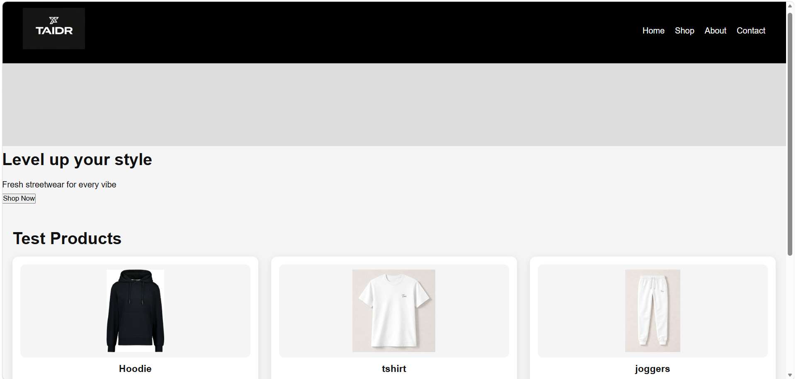
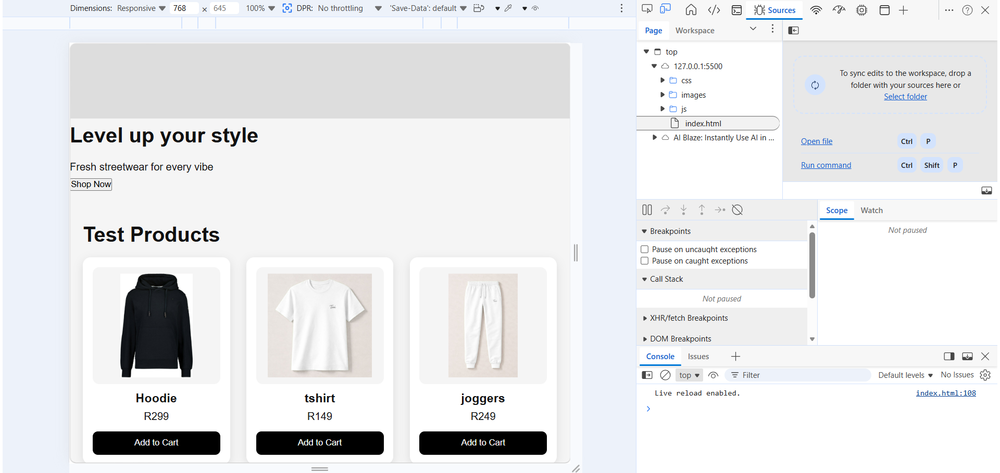
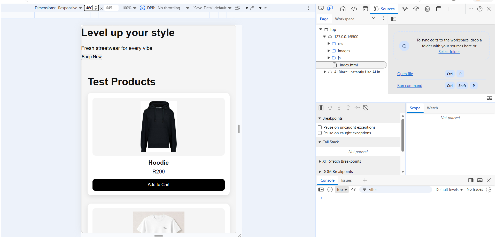

# online-clothing-store# Online Clothing Store (Tai DripSA)

## Project Overview
This is a responsive online clothing store website built using HTML, CSS, and JavaScript. The website showcases streetwear products and allows users to browse items in a clean and modern layout.

## Technologies Used
- HTML5
- CSS3
- JavaScript

## Features
- Responsive design for desktop, tablet, and mobile
- Product grid layout using CSS Grid
- Navigation using Flexbox
- Interactive buttons with hover effects

## Responsive Design
The website was tested across multiple screen sizes:
- Desktop view (large screens)
- Tablet view (768px breakpoint)
- Mobile view (480px breakpoint)

## Screenshots

### Desktop View

### Tablet View

### Mobile View

## Changelog

### 28 May 2026
- Created responsive CSS layout using Flexbox and Grid
- Implemented external stylesheet structure
- Added navigation bar with hover effects
- Built product card system for clothing items
- Added responsive breakpoints for tablet and mobile
- Improved UI design and spacing consistency

# TAIDR Online Clothing Store

# WEBSITE PROJECT PROPOSAL  
## TAIDR Streetwear Brand Website  

**Subject Name & Code:** Web Development (WD101)  
**Full Name:** [lethabo]
**Student Number:** [st10514103]  
**Group:** [Gr.1]  

## Project Overview
TAIDR is a modern streetwear clothing brand focused on clean, bold, and minimal designs. The brand targets youth culture and aims to reflect identity, creativity, and confidence through fashion.

## Purpose of the Project
The purpose of this project is to demonstrate the development of a functional website using front-end technologies and version control systems.

##Tools Used
- HTML (structure)
- CSS (styling)
- JavaScript (interactivity)
- Visual Studio Code
- Git & GitHub (version control)
##  Site Map
The following diagram shows the structure of the website:

- Homepage with branding and navigation
- Product display section
- Simple and clean user interface
- Organized file structure

## Project Structure
- index.html
- style.css
- script.js
- images/

## Timeline & Milestones  

| Week | Task |
|------|------|
| Week 1 | Research, planning, and defining brand identity |
| Week 2 | Creating sitemap and wireframes |
| Week 3 | Built homepage, shop and navigation using HTML and CSS | 
| Week 4 | Fixed layout issues, added images, and uploaded project to GitHub Pages  

 ## Challenges Faced  
- Designing a responsive layout  
- Structuring multiple pages correctly  
- Managing project files and images

##  Change Log  

### 1.0 – Initial Setup  
- Created project folder structure  
- Set up HTML pages (Home, Shop, About, Contact)  
- Linked CSS file  

### 1.1 – Layout Development  
- Designed homepage layout  
- Added navigation bar  
- Started styling with CSS  

### 1.2 – Content & Features  
- Added product sections on shop page  
- Inserted images and branding  
- Improved page structure  

### 1.3 – Final Improvements  
- Fixed responsive layout issues  
- Improved spacing and alignment  
- Uploaded final version to GitHub  

##  GitHub Repository
https://github.com/Taiman101/online-clothing-store.git
##  Conclusion
This project demonstrates basic web development skills and the use of GitHub for managing and storing a project online.

## References
- https://developer.mozilla.org/en-US/docs/Web/CSS
- https://www.w3schools.com/css/

